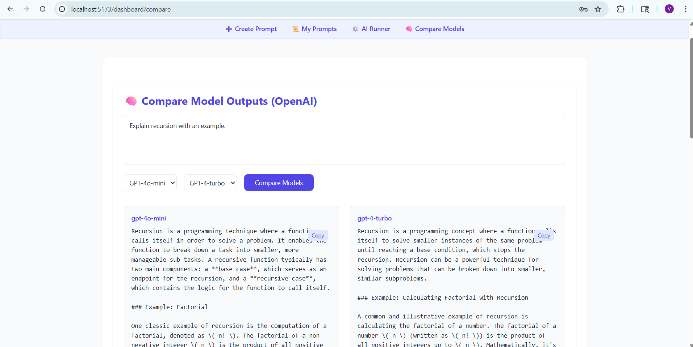

# ⚙️ PromptForge Studio  
### 🧠 _AI Prompt Engineering Workbench with Real-Time LLM Comparison_



---

## 🚀 Overview

**PromptForge Studio** is a full-stack prompt management and testing platform built using **React + Supabase + OpenAI API**.  
It allows AI engineers and developers to **create, organize, test, and compare prompts** across multiple LLMs — all in one place.

---

## 🧠 Key Features

✅ **Secure Authentication (Supabase)** — email-based login & logout  
✅ **Prompt Management** — create, edit, delete, and store templates  
✅ **Automatic Version Control** — saves every previous prompt version  
✅ **AI Model Comparison** — test prompts on GPT-4o-mini and GPT-4-turbo  
✅ **Visual Diff Viewer** — highlights how model responses differ  
✅ **Clean Responsive UI** — built with Tailwind CSS and React Hooks

---

## 🧰 Tech Stack

| Layer | Tools |
|-------|--------|
| Frontend | React 19, TypeScript, Tailwind CSS |
| Backend / DB | Supabase (PostgreSQL + Auth) |
| AI Integration | OpenAI API |
| Utilities | Diff2Html, React Hot Toast |
| Deployment | Vercel / Netlify |

---

## ⚙️ Setup & Installation

1️⃣ **Clone the repository**
```bash
git clone https://github.com/yourusername/promptforge-studio.git
cd promptforge-studio

2️⃣ Install dependencies

npm install --legacy-peer-deps

3️⃣ Create a .env file

VITE_SUPABASE_URL=your_supabase_url
VITE_SUPABASE_ANON_KEY=your_supabase_anon_key
VITE_OPENAI_API_KEY=your_openai_api_key

4️⃣ Run the app

npm run dev

Open http://localhost:5173
 to view your app.

 🌐 Live Demo

🔗 https://promptforge-studio.vercel.app

🧱 License

MIT License © 2025 — PromptForge Studio